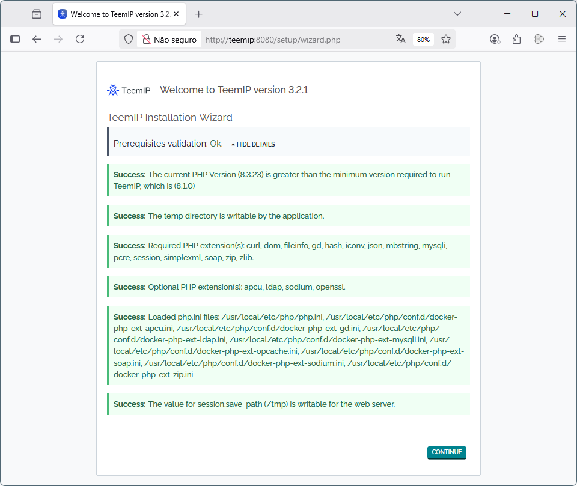

<p align="center">

</p>
All network administrators do recognize how important it is to have a well managed IP space: a comprehensive and up to date inventory of all subnets and IPs used in a network as well as clear and simple processes to request, change or release IPs are underlying key factors for a trouble free network.

Unfortunately, in many companies or organizations, IP Management is not perceived as a critical service of IT operations. And when it is recognized as such, the price of standard solutions sold from software vendors is so high that investment in a tool is always postponed to the next fiscal exercise.

As a consequence, network administrators often struggle to keep a decent inventory of their IP space and they rely by default on inconvenient Excel spread sheets or DNS configuration files to do their job.

TeemIp project has precisely been created to answer that problematic. It’s an open source solution that offers:

An IP referential to manage IPv4 and IPv6 addressing plans: 
 - blocks of subnets, subnets, IP ranges and IP addresses;
 - An IP discovery tool;
 - A CMDB to manage standard CIs as well as VLANs, WAN links, AS numbers and VRFs;
 - Domain name and zone management capabilities;
 - An IP request workflow to process allocations, changes or releases of IP addressses or subnets;
 - And more as you’ll discover on this site.
 - 
TeemIp is licensed under the terms of the [GNU Affero General Public License](https://www.gnu.org/licenses/agpl-3.0.en.html) Version 3 as published by the Free Software Foundation.


`entrypoint.sh`
```
#!/bin/bash

if [ ! -z "$(ls -A "/var/www/html/")" ]; then
  echo "The Folder is not empty."
else
  echo "Folder empty. Proced with installation."
  wget https://sourceforge.net/projects/teemip/files/teemip%20-%20a%20standalone%20application/3.2.1/TeemIP-3.2.1-2412.zip/download \
    -O /tmp/TeemIP-3.2.1-2412.zip
  unzip /tmp/TeemIP-3.2.1-2412.zip "web/*" -d /tmp/
  cp -rf /tmp/web/* /var/www/html/
  rm -rf /tmp/*
  chown -R www-data:www-data /var/www/html
fi

echo "Starting Apache..."
exec "$@"
```
`Dockerfile`
```
FROM php:8.3-apache

RUN apt update  -y
RUN apt install -y \
  nano \
  graphviz \
  wget \
  zip \
  && apt-get clean

# This repository contains a script that can be used to easily install
# a PHP extension inside the official PHP Docker images.
# https://github.com/mlocati/docker-php-extension-installer/
COPY --from=ghcr.io/mlocati/php-extension-installer /usr/bin/install-php-extensions /usr/local/bin/
RUN install-php-extensions gd mysqli soap zip ldap apcu

# Copy custom PHP config.
COPY files/php.ini-production "$PHP_INI_DIR/php.ini"

# Copy entrypoint file and run.
COPY docker/entrypoint.sh /usr/local/bin/entrypoint.sh
RUN chmod +x /usr/local/bin/entrypoint.sh

# Set the entrypoint
ENTRYPOINT ["/usr/local/bin/entrypoint.sh"]

# Use CMD to start Apache (will be passed as arguments to entrypoint.sh)
CMD ["apache2-foreground"]

```

```console
docker build -t leandroecomp/teemip:0.1 -t leandroecomp/teemip:latest -f Dockerfile .
```
Run the container
```console
docker run --name teemip -d -p 8080:80 -v /volumes/teemip:/var/www/html  leandroecomp/teemip:latest
abae78ac2d2820183db11fd86584a0eaae22ddd12a5348ad228440ba4acad78e
```

Access browser `hjttp://teeip.localdomain:8080`
<p align="center">

</p>
